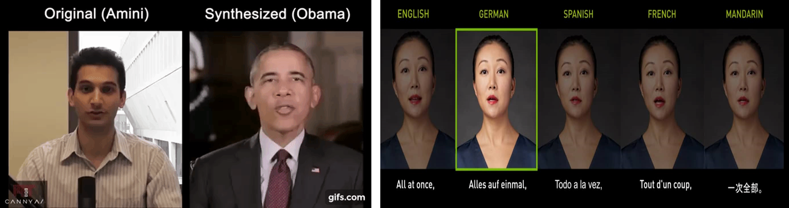
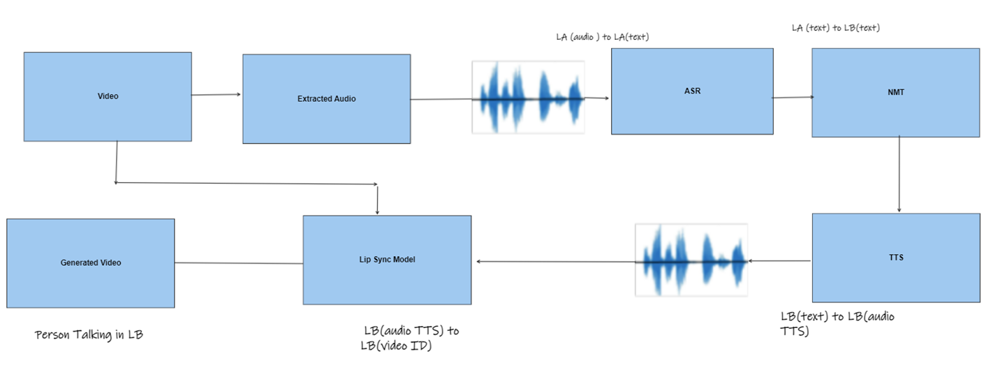
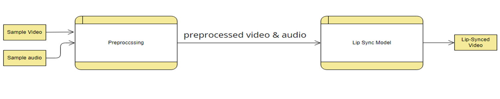
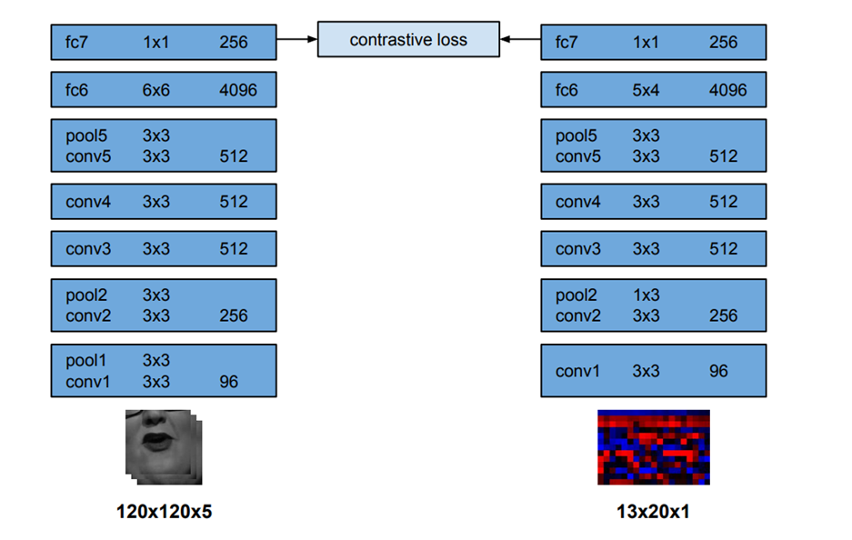

# AutomaticLipSyncGP
This is our Graduation Project of Bachelor degree 
In this project we tackle the challenge of dubbing confrences  where a speaker may speak in language A (English) and we need to listen to his speak in language B (Arabic) 

## Introduction 

Deep fake can be used in an unatheical manners but we encourage the good usage of it by this project 

We implemented the Wav2lip paper  with adding more input paths for the translation pipline  ,where user can input a text ,audio or a video
This figure demonstrate the options.

Lip sync module  demonestration : 

## Evaluation of solution :
The evaluation of finetuning the wav2lip model on any dataset is done by using a critic model called SyncNet by getting embbeding of audio and video and calculate a distance between them .

## Sample outpouts :
Videos demonestrate some output of the system

https://drive.google.com/drive/folders/1Eu6VUiaROIdzITwHWQqf2rapiPIuJO4y

